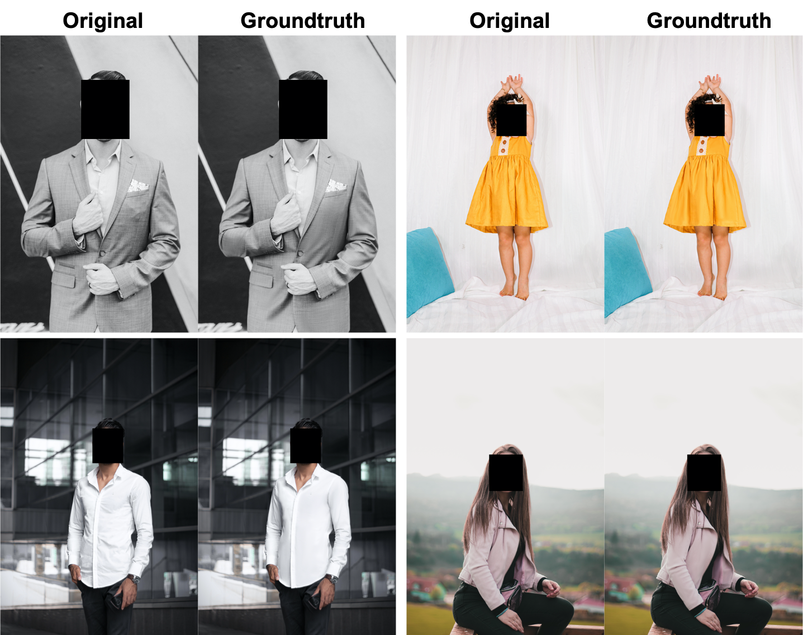

# High-definition Cloth Retouching (CRHD-3K) Dataset 
High-definition Cloth Retouching (CRHD-3K) is a high-quality dataset for cloth retouching, which aims to remove the wrinkles, creases, and other blemishes on the clothes to make them look more smooth and beautiful. It includes 3,022 pairs of raw and retouching photos, where the raw photos were collected from [Unsplash](https://unsplash.dogedoge.com) and the retouching process was accomplished by a team of professional image editors. The dataset is released as part of the following paper:

> **ABPN: Adaptive Blend Pyramid Network for Real-Time Local Retouching of Ultra High-Resolution Photo**<br>
> Biwen Lei, Xiefan Guo, Hongyu Yang, Miaomiao Cui, Xuansong Xie, Di Huang<br>
> In CVPR 2022<br>

[DAMO Academy, Alibaba Group](https://damo.alibaba.com), Hangzhou, China

[Paper](https://openaccess.thecvf.com/content/CVPR2022/papers/Lei_ABPN_Adaptive_Blend_Pyramid_Network_for_Real-Time_Local_Retouching_of_CVPR_2022_paper.pdf) | [Supp](https://openaccess.thecvf.com/content/CVPR2022/supplemental/Lei_ABPN_Adaptive_Blend_CVPR_2022_supplemental.pdf)

We will release the code of ABPN soon, before that, if you are interested in skin retouching, 
you may refer to [modelscope](https://www.modelscope.cn/models/damo/cv_unet_skin-retouching/summary), in which we released the models of portrait skin retouching for  application.  In one of the models, we leveraged the concept of blend layers in ABPN and achieved good results.

## Samples


## Overview
All data (`CRHD-3K`) can be downloaded below.

| Path   |  Size   |  Files  |    Format   | Description                   |
| :----- | :---:   |   ---:  |    :---:    | :-------                      |
| CRHD-3K          |         |      |      |
| &boxvr;&nbsp;[CRHD-3K_src](https://drive.google.com/file/d/1Px1UoTsvcW831G9lzVd9DpaCUGVTLclp/view?usp=sharing)  | 8.2 GB  | 3022 | JPG (ZIP package)  | Source images                 |
| &boxvr;&nbsp;[CRHD-3K_gt](https://drive.google.com/file/d/11fvSuR4qCK9gppu3i9G1qG1zWRk0RM_x/view?usp=sharing)  | 9.1 GB  | 3022 | JPG (ZIP package)  | Target images                 |


## Agreement
- All files in the CRHD-3K dataset are available for ***non-commercial research purposes*** only.
- You agree not to reproduce, duplicate, copy, sell, trade, resell or exploit for any commercial purposes, any portion of the images and any portion of derived data.

### Citation
If you use this dataset for your research, please cite our paper.
```
@inproceedings{lei2022ABPN,
  title={ABPN: Adaptive Blend Pyramid Network for Real-Time Local Retouching of Ultra High-Resolution Photo},
  author={Biwen, Lei and Xiefan, Guo and Hongyu, Yang and Miaomiao, Cui and Xuansong,  Xie and Di, Huang},
  booktitle={Proceedings of the IEEE Conference on Computer Vision and Pattern Recognition},
  year={2022}
}
```


### Contact
Should you have any questions, please contact me via `biwen.lbw@alibaba-inc.com`.
